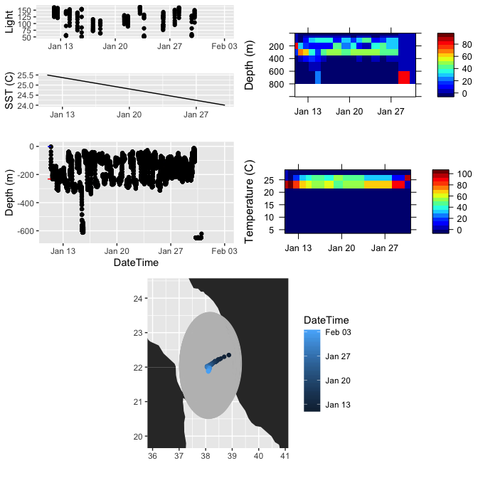
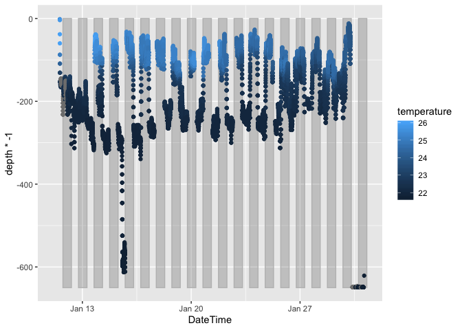

PSAT example
================
Camrin Braun
Last updated: 2020-04-24

This is an example script for a general workflow to deal with PSAT data.
Note this script is missing the following (as of 20200424): \* nicer
etuff print function \* treatment of multiple time zones for a single
track / dataset

``` r
library(lubridate)
library(tidyverse)
library(lattice)
library(lutz)
library(raster)
# this should be publicly available on my github, it may install as a package but can definitely just load_all
devtools::load_all('../tags2etuff') 
devtools::load_all('../analyzePSAT')
```

## Raw tag data to eTUFF

First we convert the “raw” tag data from whatever format it’s in into a
standardized, self-contained flat file called eTUFF. This is a product
of the NASA OIIP project and is the backbone of tag data standardization
in our group. For more info, check out the OIIP website and especially
look over the metadata and observation data types spreadsheets in the
tagbase repo on Github.

Note the master metadata spreadsheet currently lives in a private repo
on Github (`nip_drake`). Request access from CDB if you need it.

``` r
## tell it where your data lives
data_dir <- './inst/extdata/159922_2020_196385/'

## load all tag metadata master sheet
meta <- read.table('../nip_drake/RawData/all_tag_meta.csv', sep=',', header=T, blank.lines.skip = F, skip=0, stringsAsFactors = F)
meta$time_coverage_start <- as.POSIXct(meta$time_coverage_start, tz='UTC')
meta$time_coverage_end <- as.POSIXct(meta$time_coverage_end, tz='UTC')

## we currently use a unique instrument name for each deployment (taxonserialnumber_deploymentyear_tagPTT)
idx <- which(meta$instrument_name == '159922_2020_196385')
meta_row <- meta[idx,]

etuff <- tag_to_etuff(data_dir, meta_row, gpe3 = TRUE)
```

    ## [1] "Getting obsTypes..."
    ## [1] "Reading Wildlife Computers PSAT..."
    ## [1] "Getting PDT data..."
    ## [1] "No Archive data to read."
    ## [1] "Getting Series data..."
    ## [1] "Getting light data..."
    ## [1] "Getting min/max depth data..."
    ## [1] "Getting SST data..."
    ## [1] "No Wildlife MixedLayer data to gather."
    ## [1] "Getting Histos data..."
    ## [1] "Getting GPE3 data..."

    ## Loading required namespace: ncdf4

    ## [1] 1
    ## [1] 2
    ## [1] 3
    ## [1] 4
    ## [1] 5
    ## [1] 6
    ## [1] 7
    ## [1] 8
    ## [1] 9
    ## [1] 10
    ## [1] 11
    ## [1] 12
    ## [1] 13
    ## [1] 14
    ## [1] 15
    ## [1] 16
    ## [1] 17
    ## [1] 18
    ## [1] 19
    ## [1] 20
    ## [1] 21
    ## [1] 22
    ## [1] 23
    ## [1] 24
    ## [1] 25
    ## [1] 26
    ## [1] 27
    ## [1] 28
    ## [1] 29
    ## [1] 30
    ## [1] 31
    ## [1] 32
    ## [1] 33
    ## [1] 34
    ## [1] 35
    ## [1] 36
    ## [1] 37
    ## [1] 38
    ## [1] 39
    ## [1] 40
    ## [1] 41
    ## [1] 42
    ## [1] 43
    ## [1] 44
    ## [1] 45
    ## [1] 46

The `tag_to_etuff` function does the magic. It’s currently optimized for
WC tags but can handle some MT and Lotek data types. Functionality for
the less-supported types will improve (via our active development) when
we actually work with more of that data. Until then, the functionality
for those remains limited. But as you can see, this function is
essential to the rest of what we’re doing.

Next, generate a simple QC plot to check the data before confirming the
etuff conversion. Eventually this will be the final QC step prior to
ingestion into the lab’s SQL database. Until the db is functional, we’ll
base all of our subsequent code on the eTUFF file
    itself.

``` r
g <- qc_psat_etuff(etuff, meta_row, writePNG = F, map = T)
```

    ## No id variables; using all as measure variables

    ## Warning: Removed 18648 rows containing missing values (geom_point).

    ## Warning: Removed 2546 rows containing missing values (geom_point).

    ## Warning: Removed 7 rows containing missing values (geom_path).
    
    ## Warning: Removed 7 rows containing missing values (geom_path).

    ## [1] "Capture output and use gridExtra::grid.arrange(g) to show plot in device."

``` r
gridExtra::grid.arrange(g)
```

<!-- -->

However, when you do this for the example thresher dataset, the QC plot
shows the mortality part of the data needs to be trimmed\!\! You may
want to go back and set the “pop” date to cut the mortality out of the
data for downstream analyses or at least note that mortality in the row
of the metadata (which will later be stored with the data in the eTUFF
file for self-contained-edness).

Also note that I often do the steps above in batch for a set of data
(i.e. that someone gives me for some analysis). When I do this as a
batch of tag data, I have some code here to write to variables in meta
that detail any known QC issues. For example, I would write a short
prompt so the code will ask me to provide details on `meta$end_type` and
`meta$end_details` which would be some derivation of mortality for the
thresher example. See other rows in the metadata sheet for examples of
what these descriptors should look like.

At this point, you’d want to build the metadata header in prep for
writing an eTUFF file:

``` r
## here's the metadata magic
build_meta_head(meta_row = etuff$meta, write_hdr = F)
```

    ##      Category AttributeID    AttributeName
    ## 124 waypoints        1000 waypoints_source
    ## 137   quality        1200    found_problem
    ## 138   quality        1201        person_qc
    ## <simpleError: missing required metadata attributes. The missing attributes have been printed to the console. To store as variable you can run foo <- build_meta_head().>

    ## Error: missing required metadata attributes. The missing attributes have been printed to the console. To store as variable you can run foo <- build_meta_head().

This should yell at you that the QC parts of meta haven’t been filled
out and thus is not ready for etuff conversion. This is just a catch to
make sure we aren’t “approving” a file and writing it to eTUFF if it
hasn’t actually been QC’d. So let’s fix the issues.

``` r
## we add the QC vars it wants
etuff$meta$found_problem <- 'no'
etuff$meta$person_qc <- 'Camrin Braun'
etuff$meta$waypoints_source <- 'GPE3'


## and now it works
build_meta_head(meta_row = etuff$meta, filename = outName_hdr, write_hdr = F)
```

    ##  [1] "// global attributes:"                                          
    ##  [2] "// etag device attributes:"                                     
    ##  [3] "  :instrument_name = \"159922_2020_196385\""                    
    ##  [4] "  :instrument_type = \"popup\""                                 
    ##  [5] "  :manufacturer = \"Wildlife\""                                 
    ##  [6] "  :model = \"miniPAT\""                                         
    ##  [7] "  :owner_contact = \"camrin.braun@gmail.com\""                  
    ##  [8] "  :person_owner = \"Camrin Braun\""                             
    ##  [9] "  :serial_number = \"19P0534\""                                 
    ## [10] "  :ptt = \"196385\""                                            
    ## [11] "// etag attachment attributes:"                                 
    ## [12] "  :attachment_method = \"hand tag over gunnel\""                
    ## [13] "  :anchor_type = \"nylon umbrella Domeier dart\""               
    ## [14] "  :mount_type = \"dorsal musculature\""                         
    ## [15] "  :release_method = \"corrosive burn wire\""                    
    ## [16] "  :tether_assembly = \"300 lb mono\""                           
    ## [17] "  :tether_length_cm = \"20cm\""                                 
    ## [18] "  :tether_material = \"300lb mono\""                            
    ## [19] "// etag deployment attributes:"                                 
    ## [20] "  :geospatial_lat_start = \"22.32966667\""                      
    ## [21] "  :geospatial_lon_start = \"38.87583333\""                      
    ## [22] "  :time_coverage_start = \"2020-01-10\""                        
    ## [23] "  :location_capture = \"Red Sea\""                              
    ## [24] "  :method_capture = \"rod and reel\""                           
    ## [25] "  :vessel_capture = \"Blue Water\""                             
    ## [26] "  :temp_degC_capture = \"26\""                                  
    ## [27] "// etag end of mission attributes:"                             
    ## [28] "  :time_coverage_end = \"2020-01-31\""                          
    ## [29] "  :end_details = \"Argos\""                                     
    ## [30] "  :end_type = \"mortality\""                                    
    ## [31] "  :geospatial_lat_end = \"21.874\""                             
    ## [32] "  :geospatial_lon_end = \"38.0528\""                            
    ## [33] "// etag animal attributes:"                                     
    ## [34] "  :length_capture = \"49\""                                     
    ## [35] "  :length_method_capture = \"estimated\""                       
    ## [36] "  :length_type_capture = \"fork length\""                       
    ## [37] "  :length_unit_capture = \"in\""                                
    ## [38] "  :platform = \"Alopias pelagicus\""                            
    ## [39] "  :taxonomic_serial_number = \"159922\""                        
    ## [40] "  :lifestage_capture = \"sub-adult\""                           
    ## [41] "  :sex = \"male\""                                              
    ## [42] "  :tissue_sample_capture = \"1\""                               
    ## [43] "// etag waypoints attributes:"                                  
    ## [44] "  :waypoints_source = \"GPE3\""                                 
    ## [45] "// etag quality attributes:"                                    
    ## [46] "  :found_problem = \"no\""                                      
    ## [47] "  :person_qc = \"Camrin Braun\""                                
    ## [48] "// data:"                                                       
    ## [49] "// DateTime,VariableID,VariableValue,VariableName,VariableUnits"

That should’ve fixed it and written out a big nasty pile of lovely
metadata text. Next stop standardization town.

If the above is all good, write the header and add the data. This is a
two step process, the second step just appends etuff to the header that
was just written to disk:

``` r
## check the meta hdr
etuff_file <- paste(data_dir, etuff$meta$instrument_name, '_eTUFF.txt', sep='')

write_etuff(etuff, etuff_file, meta_row = etuff$meta)
```

    ## No id variables; using all as measure variables

    ## [1] "Getting obsTypes..."
    ## [1] "Header written to ./inst/extdata/159922_2020_196385/159922_2020_196385_eTUFF.txt."
    ## [1] "Adding data to eTUFF file ./inst/extdata/159922_2020_196385/159922_2020_196385_eTUFF.txt."

Congrats, you now have a standardized, self-contained tag data file that
can essentially be shared with and read by anyone\! The best part is
that now that it’s standardized we can write smart analysis pipelines
for standardized data. This requires no special coding each time some
tiny thing about the data (on the tag side) changes because eTUFF is a
standard format. Ultimately this saves us a TON of work.

## eTUFF to the usual data types

Start by just reading the eTUFF file we just
created

``` r
etuff_file <- './inst/extdata/159922_2020_196385/159922_2020_196385_eTUFF.txt'

etuff <- read_etuff(etuff_file)
```

    ## [1] "metaTypes is NULL. Trying to retrieve from github."

    ## Warning in read_etuff(etuff_file): Some restrictions on metaTypes$Necessity
    ## are being relaxed. Provide your own metaTypes input here to keep default
    ## necessity values.

    ## Warning: NAs introduced by coercion

    ## [1] "2020-01-31 has been parsed as 2020-01-31. If this is incorrect, the auto-detection of the date format is wrong."
    ## [1] "2020-01-10 has been parsed as 2020-01-10. If this is incorrect, the auto-detection of the date format is wrong."

    ## Warning in read_etuff(etuff_file): Current TZ specification is UTC.

By printing `etuff` we currently get a big sloppy data frame. In the
future, we’ll make a nice print function that provides a nice succinct
summary of the dataset.

Get the usual PDT data:

``` r
pdt <- get_pdt(etuff)
```

Note this is how we’ll get PDT data for any tag type with any temporal
resolution. Ever. The series is even more fun but first let’s run a
quick LOESS interpolation on the PDT data to fill in the gaps:

``` r
pdt_interp <- interp_pdt(etuff)
```

    ## 
      |                                                                       
      |                                                                 |   0%
      |                                                                       
      |                                                                 |   1%
      |                                                                       
      |=                                                                |   1%
      |                                                                       
      |=                                                                |   2%
      |                                                                       
      |==                                                               |   2%
      |                                                                       
      |==                                                               |   3%
      |                                                                       
      |==                                                               |   4%
      |                                                                       
      |===                                                              |   4%
      |                                                                       
      |===                                                              |   5%
      |                                                                       
      |====                                                             |   6%
      |                                                                       
      |====                                                             |   7%
      |                                                                       
      |=====                                                            |   7%
      |                                                                       
      |=====                                                            |   8%
      |                                                                       
      |======                                                           |   8%
      |                                                                       
      |======                                                           |   9%
      |                                                                       
      |======                                                           |  10%
      |                                                                       
      |=======                                                          |  10%
      |                                                                       
      |=======                                                          |  11%
      |                                                                       
      |=======                                                          |  12%
      |                                                                       
      |========                                                         |  12%
      |                                                                       
      |========                                                         |  13%
      |                                                                       
      |=========                                                        |  13%
      |                                                                       
      |=========                                                        |  14%
      |                                                                       
      |==========                                                       |  15%
      |                                                                       
      |==========                                                       |  16%
      |                                                                       
      |===========                                                      |  16%
      |                                                                       
      |===========                                                      |  17%
      |                                                                       
      |===========                                                      |  18%
      |                                                                       
      |============                                                     |  18%
      |                                                                       
      |============                                                     |  19%
      |                                                                       
      |=============                                                    |  19%
      |                                                                       
      |=============                                                    |  20%
      |                                                                       
      |=============                                                    |  21%
      |                                                                       
      |==============                                                   |  21%
      |                                                                       
      |==============                                                   |  22%
      |                                                                       
      |===============                                                  |  22%
      |                                                                       
      |===============                                                  |  23%
      |                                                                       
      |===============                                                  |  24%
      |                                                                       
      |================                                                 |  24%
      |                                                                       
      |================                                                 |  25%
      |                                                                       
      |=================                                                |  26%
      |                                                                       
      |=================                                                |  27%
      |                                                                       
      |==================                                               |  27%
      |                                                                       
      |==================                                               |  28%
      |                                                                       
      |===================                                              |  28%
      |                                                                       
      |===================                                              |  29%
      |                                                                       
      |===================                                              |  30%
      |                                                                       
      |====================                                             |  30%
      |                                                                       
      |====================                                             |  31%
      |                                                                       
      |====================                                             |  32%
      |                                                                       
      |=====================                                            |  32%
      |                                                                       
      |=====================                                            |  33%
      |                                                                       
      |======================                                           |  33%
      |                                                                       
      |======================                                           |  34%
      |                                                                       
      |=======================                                          |  35%
      |                                                                       
      |=======================                                          |  36%
      |                                                                       
      |========================                                         |  36%
      |                                                                       
      |========================                                         |  37%
      |                                                                       
      |========================                                         |  38%
      |                                                                       
      |=========================                                        |  38%
      |                                                                       
      |=========================                                        |  39%
      |                                                                       
      |==========================                                       |  39%
      |                                                                       
      |==========================                                       |  40%
      |                                                                       
      |==========================                                       |  41%
      |                                                                       
      |===========================                                      |  41%
      |                                                                       
      |===========================                                      |  42%
      |                                                                       
      |============================                                     |  42%
      |                                                                       
      |============================                                     |  43%
      |                                                                       
      |============================                                     |  44%
      |                                                                       
      |=============================                                    |  44%
      |                                                                       
      |=============================                                    |  45%
      |                                                                       
      |==============================                                   |  46%
      |                                                                       
      |==============================                                   |  47%
      |                                                                       
      |===============================                                  |  47%
      |                                                                       
      |===============================                                  |  48%
      |                                                                       
      |================================                                 |  48%
      |                                                                       
      |================================                                 |  49%
      |                                                                       
      |================================                                 |  50%
      |                                                                       
      |=================================                                |  50%
      |                                                                       
      |=================================                                |  51%
      |                                                                       
      |=================================                                |  52%
      |                                                                       
      |==================================                               |  52%
      |                                                                       
      |==================================                               |  53%
      |                                                                       
      |===================================                              |  53%
      |                                                                       
      |===================================                              |  54%
      |                                                                       
      |====================================                             |  55%
      |                                                                       
      |====================================                             |  56%
      |                                                                       
      |=====================================                            |  56%
      |                                                                       
      |=====================================                            |  57%
      |                                                                       
      |=====================================                            |  58%
      |                                                                       
      |======================================                           |  58%
      |                                                                       
      |======================================                           |  59%
      |                                                                       
      |=======================================                          |  59%
      |                                                                       
      |=======================================                          |  60%
      |                                                                       
      |=======================================                          |  61%
      |                                                                       
      |========================================                         |  61%
      |                                                                       
      |========================================                         |  62%
      |                                                                       
      |=========================================                        |  62%
      |                                                                       
      |=========================================                        |  63%
      |                                                                       
      |=========================================                        |  64%
      |                                                                       
      |==========================================                       |  64%
      |                                                                       
      |==========================================                       |  65%
      |                                                                       
      |===========================================                      |  66%
      |                                                                       
      |===========================================                      |  67%
      |                                                                       
      |============================================                     |  67%
      |                                                                       
      |============================================                     |  68%
      |                                                                       
      |=============================================                    |  68%
      |                                                                       
      |=============================================                    |  69%
      |                                                                       
      |=============================================                    |  70%
      |                                                                       
      |==============================================                   |  70%
      |                                                                       
      |==============================================                   |  71%
      |                                                                       
      |==============================================                   |  72%
      |                                                                       
      |===============================================                  |  72%
      |                                                                       
      |===============================================                  |  73%
      |                                                                       
      |================================================                 |  73%
      |                                                                       
      |================================================                 |  74%
      |                                                                       
      |=================================================                |  75%
      |                                                                       
      |=================================================                |  76%
      |                                                                       
      |==================================================               |  76%
      |                                                                       
      |==================================================               |  77%
      |                                                                       
      |==================================================               |  78%
      |                                                                       
      |===================================================              |  78%
      |                                                                       
      |===================================================              |  79%
      |                                                                       
      |====================================================             |  79%
      |                                                                       
      |====================================================             |  80%
      |                                                                       
      |====================================================             |  81%
      |                                                                       
      |=====================================================            |  81%
      |                                                                       
      |=====================================================            |  82%
      |                                                                       
      |======================================================           |  82%
      |                                                                       
      |======================================================           |  83%
      |                                                                       
      |======================================================           |  84%
      |                                                                       
      |=======================================================          |  84%
      |                                                                       
      |=======================================================          |  85%
      |                                                                       
      |========================================================         |  86%
      |                                                                       
      |========================================================         |  87%
      |                                                                       
      |=========================================================        |  87%
      |                                                                       
      |=========================================================        |  88%
      |                                                                       
      |==========================================================       |  88%
      |                                                                       
      |==========================================================       |  89%
      |                                                                       
      |==========================================================       |  90%
      |                                                                       
      |===========================================================      |  90%
      |                                                                       
      |===========================================================      |  91%
      |                                                                       
      |===========================================================      |  92%
      |                                                                       
      |============================================================     |  92%
      |                                                                       
      |============================================================     |  93%
      |                                                                       
      |=============================================================    |  93%
      |                                                                       
      |=============================================================    |  94%
      |                                                                       
      |==============================================================   |  95%
      |                                                                       
      |==============================================================   |  96%
      |                                                                       
      |===============================================================  |  96%
      |                                                                       
      |===============================================================  |  97%
      |                                                                       
      |===============================================================  |  98%
      |                                                                       
      |================================================================ |  98%
      |                                                                       
      |================================================================ |  99%
      |                                                                       
      |=================================================================|  99%
      |                                                                       
      |=================================================================| 100%

Now let’s get the series data. And again, this is how we’ll always get
series data from any tag manufacturer with any temporal resolution.
Pretty
    neat.

``` r
series <- get_series(etuff)
```

    ## [1] "No time zone specified. Detecting and using the time zone(s) from the tracking data. Unique time zones applied to the dataset are: Asia/Riyadh."
    ## [1] "No time zone specified. Detecting and using the time zone(s) from the tracking data. Unique time zones applied to the dataset are: Etc/GMT-3."
    ## [1] "No temporal resolution specified. Mode of diff(timeseries) yielded 75seconds."

    ## Error in get_series(etuff): Using more than one time zone is not currently supported. Instead, provide input what_tz as one of: Asia/Riyadh.Using more than one time zone is not currently supported. Instead, provide input what_tz as one of: Etc/GMT-3.

Oops, this throws a timezone error. The way it prints isn’t super nice
at the moment but what you’ll decipher is the function is trying to
assign multiple time zones (yes, the example thresher crossed a time
zone line). We don’t currently have functionality to deal wtih multiple
time zones in a single tag dataset so the error is basically asking you
to pick one of the options it gives
    you:

``` r
series <- get_series(etuff, what_tz = 'Asia/Riyadh')
```

    ## [1] "No temporal resolution specified. Mode of diff(timeseries) yielded 75seconds."

You will also notice this creates a time series from tag to pop based on
the detected temporal resolution of the series data (thresher example is
75 seconds). I think it’s much better to have a regularized time series
with a bunch of NAs than to just have those timestamps missing
completely. This is also how we calculate, for example, how much series
data we have versus what is missing (i.e. wasn’t transmitted). And we
can do some tricks like use the LOESS interpolated depth-temp info to
fill in at least some of the missing temperature measurements in the
series:

``` r
## steal some temp values from the interpolated pdt
series <- add_series_temp(series, pdt, pdt_interp)
```

    ## [1] "Series data started with 7977 NAs and ended with 5865 NAs."

``` r
## add a day/night column to your series data based on local sunrise/sunset times
series$dn <- add_daynight(series, etuff)
```

    ## [1] "No time zone specified. Detecting and using the time zone(s) from the tracking data. Unique time zones applied to the dataset are: Asia/Riyadh."
    ## [1] "No time zone specified. Detecting and using the time zone(s) from the tracking data. Unique time zones applied to the dataset are: Etc/GMT-3."

``` r
## you can also get your own df of sunrise and sunset times if you care (this is happening under the hood in add_daynight above) 
srss <- get_srss(etuff, series)
```

    ## [1] "No time zone specified. Detecting and using the time zone(s) from the tracking data. Unique time zones applied to the dataset are: Asia/Riyadh."
    ## [1] "No time zone specified. Detecting and using the time zone(s) from the tracking data. Unique time zones applied to the dataset are: Etc/GMT-3."

``` r
srss <- srss[which(srss$DateTime < max(series$DateTime_local)),]
## use the nighttime interval from srss to easily grab the next day's sunrise as the "end of night" period for plotting
srss$end_night <- srss$night_interval@start + srss$night_interval@.Data
  
ggplot(srss) + geom_rect(aes(xmin=sunset, xmax=end_night, ymin=-650, ymax=0), alpha=0.25, colour='grey') +
  geom_point(data = series, aes(x=DateTime, y=depth * -1, colour=temperature)) + ylim(-650,0)
```

<!-- -->

This will get the track from the etuff file unless the fish was
double-tagged AND thus that tag has its own etuff file. Working on how
to deal with
    that

``` r
track <- get_track(etuff)
```

    ## [1] "No time zone specified. Detecting and using the time zone(s) from the tracking data. Unique time zones applied to the dataset are: Asia/Riyadh."
    ## [1] "No time zone specified. Detecting and using the time zone(s) from the tracking data. Unique time zones applied to the dataset are: Etc/GMT-3."

## Still working on these

Unless metadata suggests the fish was double-tagged, in which case, go
get that instead:

And we need some functionality for the standard plots (but likely move
these to analyzePSAT) including: \* TAD/TAT frequency barplots (with a
day/night option) \* series data colored by temp \* interpolated PDT \*
nice but simple map, could start with HMMoce or build\_move style plots
